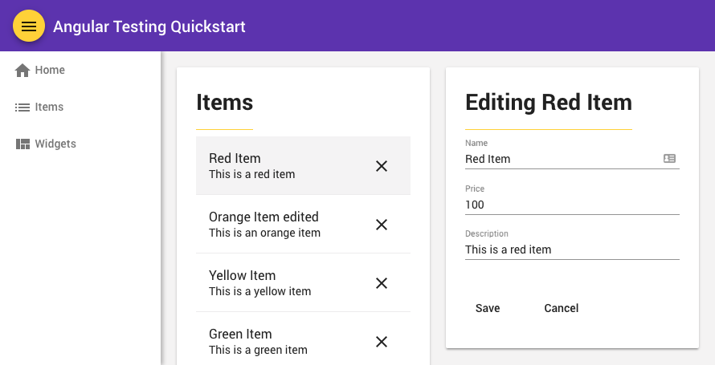

# Angular Testing Quickstart

A collection of testing examples written for Angular using the `@angular/cli`.

## Dependencies
- You must have `node` and `npm` installed (via `brew install node` or [NodeJS.org](https://nodejs.org/en/));
- Install Angular CLI via `npm i -g @angular/cli`

### Getting Started

There are two main parts to this application. The first is the REST API, for which we are using `json-server`. The second part is the Angular application server which we will start using `ng serve`.  

To get started run the commands below.

```bash
$ git clone https://github.com/onehungrymind/angular-testing-quickstart.git
$ cd angular-testing-quickstart
$ npm install
$ npm start
```

Then navigate to [http://localhost:4200](http://localhost:4200) in your browser.

## Code scaffolding

Run `ng generate component component-name` to generate a new component. You can also use `ng generate directive/pipe/service/class`.

## Build

Run `ng build` to build the project. The build artifacts will be stored in the `dist/` directory. Use the `-prod` flag for a production build.

## Running unit tests

Run `ng test` to execute the unit tests via [Karma](https://karma-runner.github.io).

## Running end-to-end tests

Run `ng e2e` to execute the end-to-end tests via [Protractor](http://www.protractortest.org/). 
Before running the tests make sure you are serving the app via `ng serve`.

